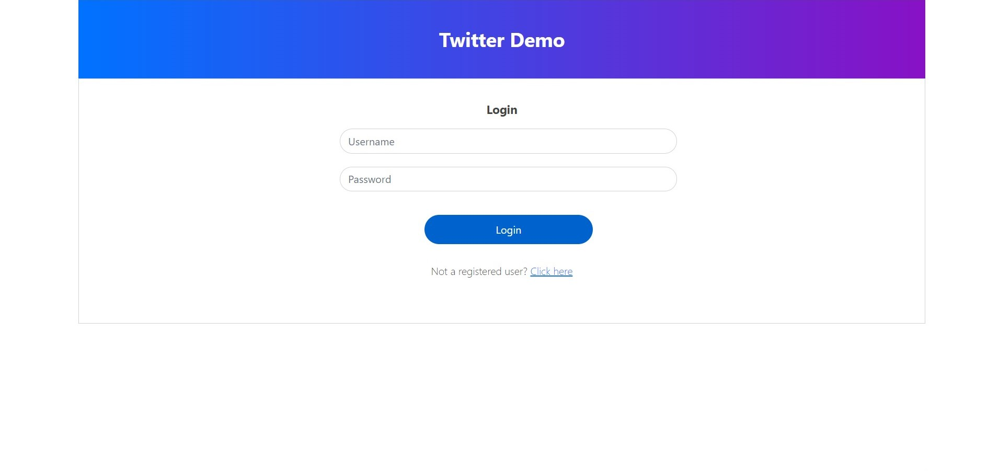
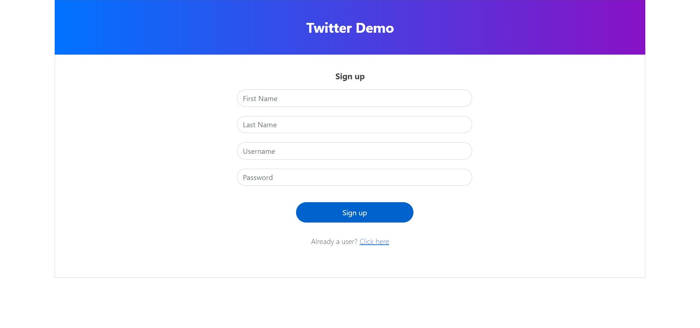
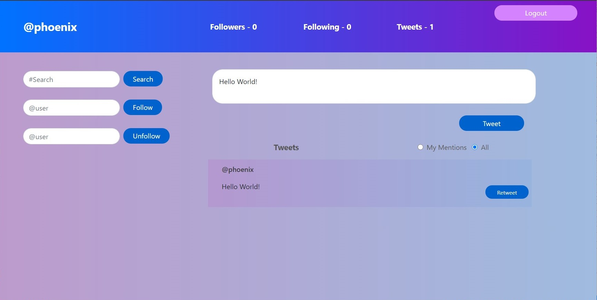

# Twitter-Live

This project is to demonstrate the following twitter functionalities using F# backend server and a simple HTML client
- User registeration
- Login / Logout
- Follow / Unfollow user
- Post tweet (with hashtags and/or mentions i.e mentioning other users)
- Retweet
- Search tweets using hashtag
- Search tweets in which you're mentioned
- Live tweet feed

 

### Backend

---

- Developed in F# using [Suave](https://suave.io/) framework
- REST API and WebSocket both are implemented using Suave library
- REST API endpoints
  - GET - "/feed/{handle}" - returns user's feed including the tweets posted by him, tweets posted by his followee, and the tweets in which he's mentioned
  - GET - "/hashtag-tweets/{hashtag}" - returns the tweets with a specific hashtag
  - GET - "/mention-tweets/{handle}" - returns the tweets in which the user is mentioned
  - POST - "/register" - register a user, takes Username, Firstname, Lastname and Password as request body parameters
  - POST - "/login" - logs in a user, takes Username and Password as request body parameter
  - POST - "/logout" - logout
  - POST - "/follow" - follow another user, takes usernames of follower and followee
  - POST - "/unfollow" - unfollow a user you're following, takes usernames of follower and followee
  - POST - "/tweet" - post a tweet, takes username and tweet content
  - POST - "/retweet" - retweet your followee's tweet, takes handle of the original poster, user's handle and id of the tweet
- WebSocket is used to deliver the following data live to the desirable client connections
  - Send tweet if any of the user you're following has made a post
  - Send tweet if someone has mentioned you in their tweet
  - Send new user added event to all the users. This is implemented from the backend and we're sending as well as receiving the new user added event on the frontend, but due to time constraints we couldn't create UI for this.
- We're using concurrent Map data structure to store all the relevant information on the server side. 

 

### Frontend

---

- Developed using HTML, CSS, JS and jQuery
- Designed login, sign-up, and home pages
- We're using [AJAX](https://api.jquery.com/jquery.ajax/) for making API requests to the server
- We're using [WebSocket](https://developer.mozilla.org/en-US/docs/Web/API/WebSocket) for handling socket connection. As soon as the user logs into the system, a websocket connection with the server is opened using `WebSocket()` constructor and it is closed when the user logs out using `WebSocket.close()` method

 

### Instructions to run

---

- Extract the zip file
- Run twitter engine
  - Move to Twitter Engine folder using `cd .\Twitter Engine\Twitter Engine\`
  - Run the command `dotnet run Twitter Engine`
  - The server should be up and running on `http://127.0.0.1:8080`
- Run twitter client
  - Move to Twitter Client folder using `File explorer`
  - Open `index.html` into browser, and you should see a login page

 

### Screenshots

---
 

